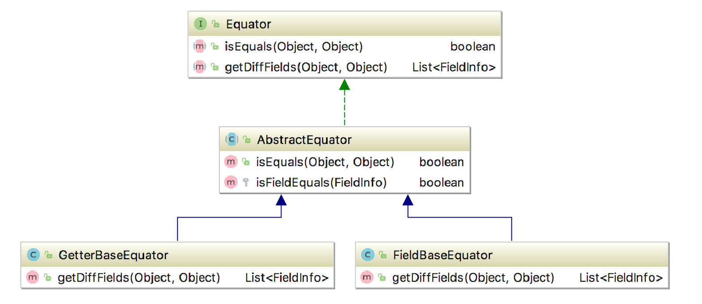

# 属性比对器

*一个用于比较两个对象的属性是否相等，并且可以获取所有不相等的属性的比对器*

# 原理

使用反射得到两个对象的属性(field或者getter方法)，比对该属性的值

# 注意事项

1. 如果有一个对象为空，则认为该对象的所有属性都为空
2. 基于getter方法的对比器，会忽略 getClass() 方法
3. 属性比对默认使用 `Objects.deepEquals` 方法进行比对，如果是集合类，会转换为数组进行对比

# 使用

## 加入依赖

加入 maven 依赖
```xml
<dependency>
    <groupId>com.github.dadiyang</groupId>
    <artifactId>equator</artifactId>
    <version>1.0.1</version>
</dependency>
```

或者下载 [equator-1.0.1.jar](https://github.com/dadiyang/equator/releases/download/v1.0.1/equator-1.0.1.jar) ，并添加到 classpath 下。

## 调用方法

这里提供了GetterBaseEquator和FieldBaseEquator两个实现类，分别对应基于getter方法和基于属性的比对器，可以根据自己的需要进行选择

```java
Equator equator = new GetterBaseEquator();
User user1 = new User(...);
User user2 = new User(...);

// 判断属性是否完全相等
equator.isEquals(user1, user2);

// 获取不同的属性
List<FieldInfo> diff = equator.getDiffFields(user1, user2);
```

# 扩展

AbstractEquator中定义了 `isFieldEquals` 方法，如果你需要对某些特殊属性进行特殊的比对，则可以覆盖此方法

# 结构图

